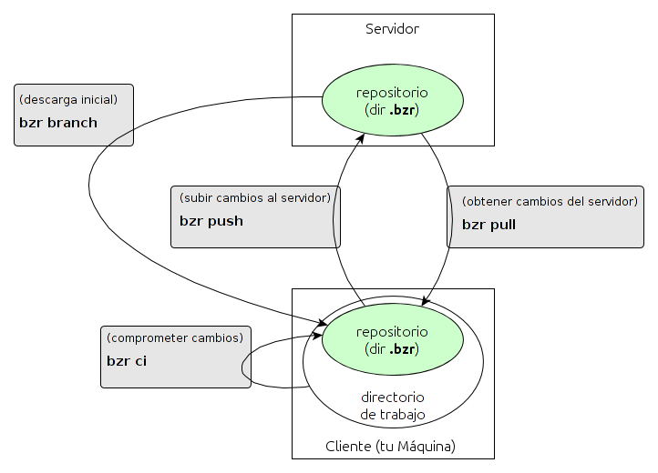

Guía de desarrollo
==================

## Instalar dependencias del proyecto
En la raíz del proyecto, ejecutar
```bash
./setup.py develop
```
o
```bash
sudo setup.py develop
```

## Bzr Workflow


* Básico - http://doc.bazaar.canonical.com/latest/en/mini-tutorial/
* Completo - http://doc.bazaar.canonical.com/bzr.dev/en/tutorials/tutorial.html
